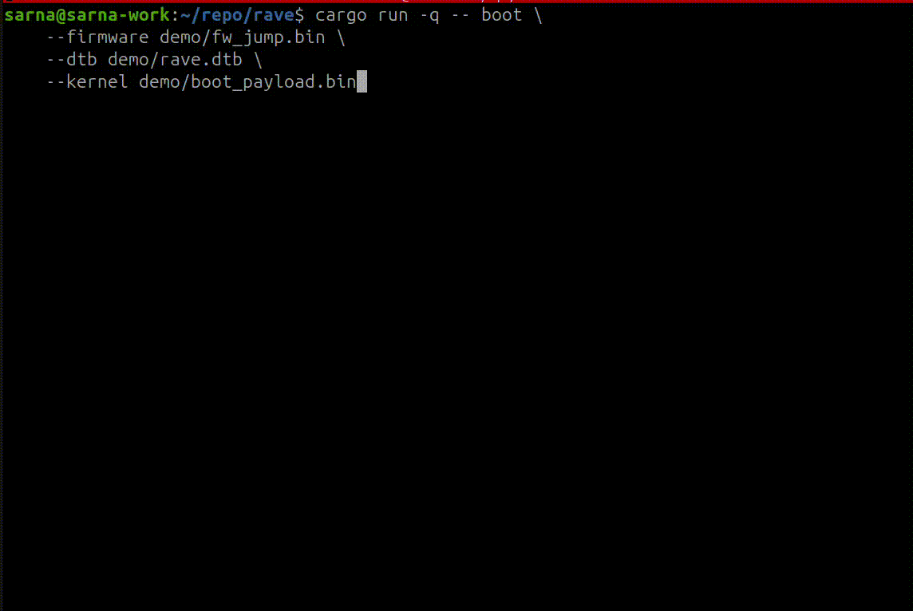

# rave


A minimal RV64IMAC_Zicsr_Zifencei (more letters coming!) emulator

- 32 integer registers and an explicit program counter
- base RV64I integer, branch, jump, and load/store instructions
- RV64M integer multiply, divide, and remainder instructions
- RV64A atomic memory operations and LR/SC reservations
- RV64C compressed integer, control-flow, and load/store instructions
- Zicsr CSR read/write, set, and clear instructions
- machine-mode trap entry for exceptions and `mret` trap return
- supervisor-mode CSRs, delegated exception trap entry, and `sret` trap return
- Sv39 page-table translation for supervisor and user instruction and data access
- Zifencei instruction-fetch fence as a validated no-op
- RV64 word operations with 32-bit sign extension
- mixed 16-bit and 32-bit instruction fetch
- raw binaries loaded into DRAM at `0x8000_0000`
- `ebreak` as a temporary host exit boundary in raw-image mode; register `a0`
  is the result code (firmware boot mode delivers architectural breakpoint traps)
- 16550-style UART input and output at `0x1000_0000`, including receive interrupts
- CLINT `msip`, `mtimecmp`, and `mtime` registers with machine software/timer interrupts
- PLIC UART external interrupt source 10 with machine and supervisor contexts

Run a raw guest image with:

```sh
cargo run -- path/to/guest.bin
```

When stdin is piped in non-interactive mode, the bytes are queued as UART
receive data for the guest.

## Firmware and OS boot



The `boot` command loads OpenSBI at `0x8000_0000`, a kernel at
`0x8020_0000`, and an 8-byte-aligned device tree near the top of guest RAM.
It starts hart 0 with the standard firmware arguments (`a0 = 0`, `a1 = DTB`)
and streams UART output while the guest runs. Headless boot runs until the guest
halts or the process is stopped; use `--limit` to impose an instruction cap:

```sh
cargo run --release -- boot \
  --firmware demo/fw_jump.bin \
  --kernel path/to/Image \
  --dtb demo/rave.dtb \
  --memory 128M
```

The precompiled `demo/rave.dtb` device tree describes the current single-hart platform, UART,
CLINT, PLIC, and 128 MiB default memory layout. Rave rejects a DTB whose single
contiguous memory region does not match `--memory`; if that option is changed,
update the memory node in the device tree to match. A Linux kernel with a
built-in initramfs can boot without a block device; virtio block storage is
still future work. Recompile the supplied source after editing it with:

```sh
dtc -I dts -O dtb -o demo/rave.dtb demo/rave.dts
```

Add `--interactive` after `boot` to inspect OpenSBI and its payload in the TUI.
The debugger's `start` command restores all three boot images and the firmware
register contract.

`demo/fw_jump.bin` is real OpenSBI 1.7 firmware, not a rave reimplementation.
It was built from the official upstream release with a small generic
configuration containing only the BSD-licensed drivers needed by rave. This
avoids pulling unrelated GPL platform modules into the binary. Its SHA-256 is
`ca3f272261a50a858dfba23a25b106905c028ccd570e9dbba924c64fca0b56c6`.
See `demo/fw_jump.NOTICE` for provenance and redistribution terms, and
`demo/fw_jump.defconfig` for the exact OpenSBI configuration.

## Debugging HQ


Launch the interactive debugger with:

```sh
cargo run -- --interactive path/to/guest.bin
```

The debugger accepts `start`, `step`/`stepi`, `next`/`nexti`, `break ADDR`,
`continue`, and `uart TEXT` (`r`, `s`/`si`, `n`/`ni`, `b`, and `c` aliases are
available). `stepi` executes exactly one instruction. Like GDB, `nexti` also
executes one instruction unless it is a call, in which case execution continues
until the call returns, a user breakpoint is reached, UART input is needed, or
the guest halts. Use Tab to select the
register pane, arrow keys to choose a register, and Enter to edit it. F5, F10,
and F11 provide continue, next, and step shortcuts; F6 opens UART input.

Use `u`, `undo`, or Ctrl-Z to restore the previous register value.
Press `q`, double-Ctrl-C, or double-Ctrl-D to quit.
If you're a man of culture, press Enter on an empty command prompt
to repeat the previous command, gdb-style.
Initial Enter defaults to `step`.

See `tests/fixtures` for integration tests that compile C with a risc-v
target. See `demo/` for a few precompiled ones. Run with e.g.

```
cargo run -- --interactive demo/uart.bin
```

Compressed-instruction demo:

```sh
cargo run -- demo/rv64c.bin
```

Machine-trap demo:

```sh
cargo run -- demo/mtrap.bin
```

Machine-timer interrupt demo:

```sh
cargo run -- --interactive demo/clint.bin
```

Machine-software interrupt demo:

```sh
cargo run -- --interactive demo/msip.bin
```

PLIC UART receive interrupt demo:

```sh
printf P | cargo run -- demo/plic.bin
```

Sv39 address-translation demo:

```sh
cargo run -- --interactive demo/sv39.bin
```

After the guest writes `satp` and enters supervisor mode, the TUI code pane
renders translated fetches as `virtual -> physical`, and load/store/AMO previews
show effective virtual addresses with their physical targets.

Privileged-memory and fence demo:

```sh
cargo run -- --interactive demo/privileged.bin
```

This self-checking guest exercises `MPRV`, `SUM`, `MXR`, `mcounteren`,
`scounteren`, and `sfence.vma`, then prints `P`. The TUI decodes
`sfence.vma` operands and exposes `mstatus`, `mcounteren`, and `scounteren` as
editable pseudo-registers.

OpenSBI handoff payload demo:

```sh
cargo run -- boot --interactive \
  --firmware demo/fw_jump.bin \
  --kernel demo/boot_payload.bin \
  --dtb demo/rave.dtb
```

Continue execution to watch the bundled production OpenSBI firmware initialize
the platform and enter the demo in supervisor mode. The payload prints
`uart echo ready` and waits for UART lines. Press F6, enter text, and submit it
to receive `got: <text>`.

For a much smaller, readable illustration of the same machine-to-supervisor
handoff, substitute `demo/boot_shim.bin`. That shim is a rave test fixture, not
OpenSBI and not a general-purpose SBI implementation.

Auto tests:
```sh
cargo test
```

Virtio is not implemented yet. The firmware boot path is present, while full
Linux compatibility may still expose privileged-architecture gaps that are not
covered by the small integration guests.
