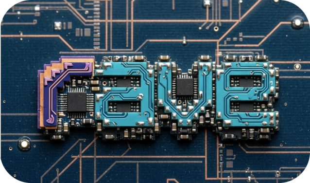
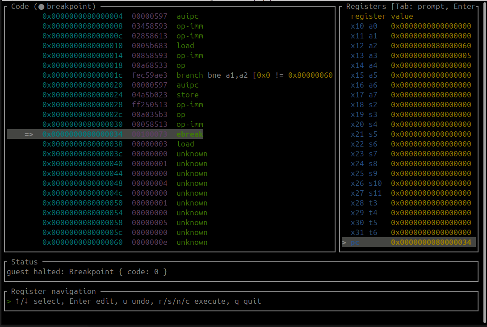

# rave



A minimal RV64IMAC_Zicsr_Zifencei (more letters coming!) emulator

- 32 integer registers and an explicit program counter
- base RV64I integer, branch, jump, and load/store instructions
- RV64M integer multiply, divide, and remainder instructions
- RV64A atomic memory operations and LR/SC reservations
- RV64C compressed integer, control-flow, and load/store instructions
- Zicsr CSR read/write, set, and clear instructions
- machine-mode trap entry for exceptions and `mret` trap return
- supervisor-mode CSRs, delegated exception trap entry, and `sret` trap return
- Sv39 page-table translation for supervisor and user instruction and data access
- Zifencei instruction-fetch fence as a validated no-op
- RV64 word operations with 32-bit sign extension
- mixed 16-bit and 32-bit instruction fetch
- raw binaries loaded into DRAM at `0x8000_0000`
- `ebreak` as a temporary host exit boundary; register `a0` is the result code
- 16550-style UART input and output at `0x1000_0000`, including receive interrupts
- CLINT `msip`, `mtimecmp`, and `mtime` registers with machine software/timer interrupts
- PLIC UART external interrupt source 10 with machine and supervisor contexts

Run a raw guest image with:

```sh
cargo run -- path/to/guest.bin
```

When stdin is piped in non-interactive mode, the bytes are queued as UART
receive data for the guest.

## Debugging HQ



Launch the interactive debugger with:

```sh
cargo run -- --interactive path/to/guest.bin
```

The debugger accepts `start`, `step`, `next`, `break ADDR`, `continue`, and `uart TEXT`
(`r`, `s`, `n`, `b`, and `c` aliases are available). Use Tab to select the
register pane, arrow keys to choose a register, and Enter to edit it. F5, F10,
and F11 provide continue, next, and step shortcuts; F6 opens UART input.

Use `u`, `undo`, or Ctrl-Z to restore the previous register value.
Press `q`, double-Ctrl-C, or double-Ctrl-D to quit.
If you're a man of culture, press Enter on an empty command prompt
to repeat the previous command, gdb-style.
Initial Enter defaults to `step`.

See `tests/fixtures` for integration tests that compile C with a risc-v
target. See `demo/` for a few precompiled ones. Run with e.g.

```
cargo run -- --interactive demo/uart.bin
```

Compressed-instruction demo:

```sh
cargo run -- demo/rv64c.bin
```

Machine-trap demo:

```sh
cargo run -- demo/mtrap.bin
```

Machine-timer interrupt demo:

```sh
cargo run -- --interactive demo/clint.bin
```

Machine-software interrupt demo:

```sh
cargo run -- --interactive demo/msip.bin
```

PLIC UART receive interrupt demo:

```sh
printf P | cargo run -- demo/plic.bin
```

Sv39 address-translation demo:

```sh
cargo run -- --interactive demo/sv39.bin
```

After the guest writes `satp` and enters supervisor mode, the TUI code pane
renders translated fetches as `virtual -> physical`, and load/store/AMO previews
show effective virtual addresses with their physical targets.

Auto tests:
```sh
cargo test
```

Virtio and a real firmware/boot path are intentionally not here yet. Full OS boot still needs more privilege and device work.
